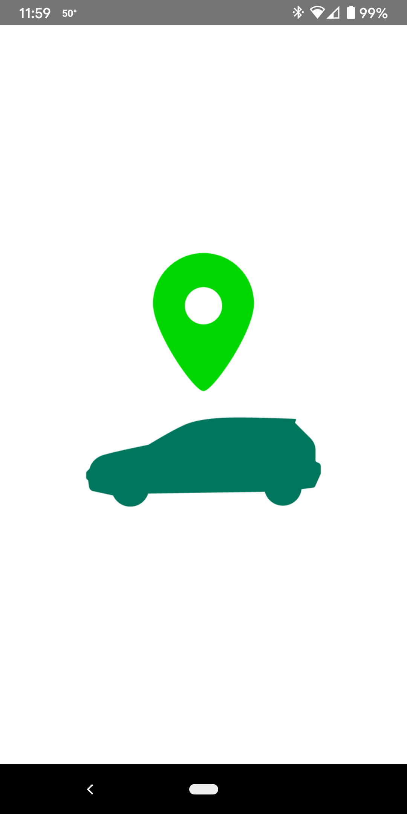
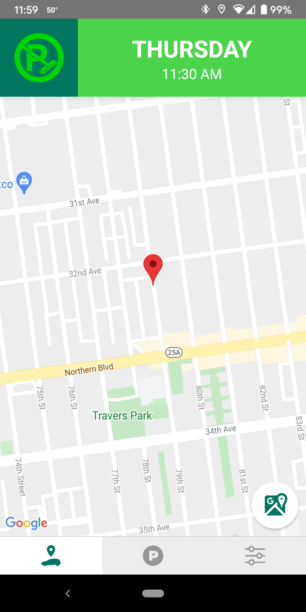
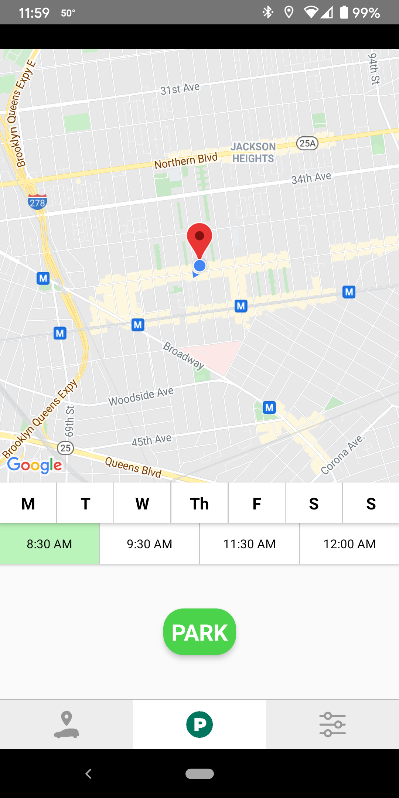
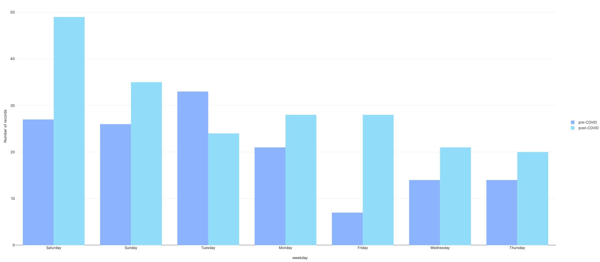
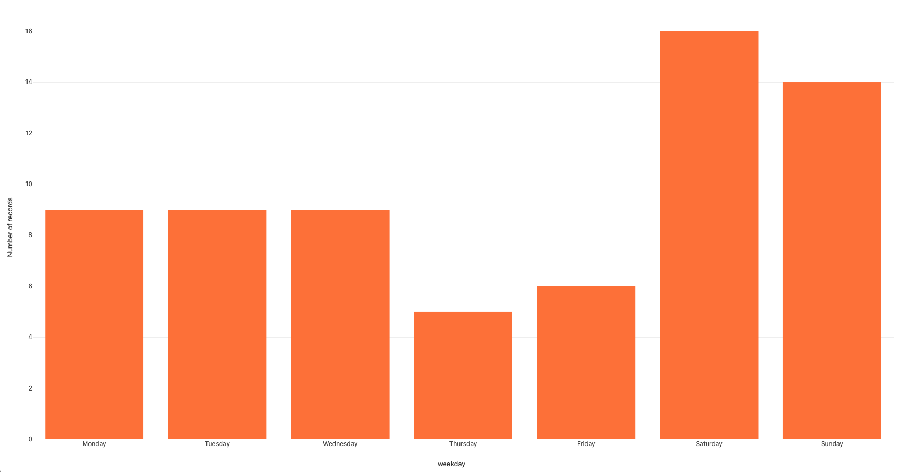
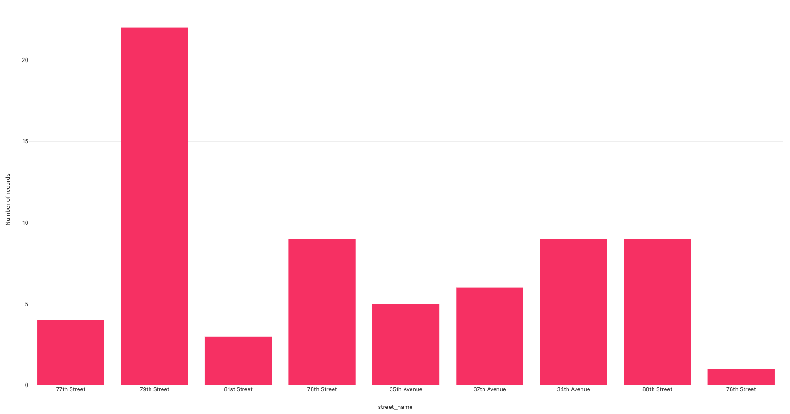

# Project Overview
The goal of the project was to analyze all of the data my partner and I have collected over roughly the past year and a half on when and where we’ve parked our car on the street. We have been tracking this information via a mobile app that we created called _Car Here Now_.

#### Screenshots of _Car Here Now_ app
          

## Workflow
While it would have been ideal to work with the data in realtime, for the purposes of this project I downloaded a raw JSON dataset on May 8, 2021 of all of our parking entries to work with.

In order to traverse the data, I began by writing a program in Python to parse the raw dataset and make it easier to work with (`cardata_parse.py`). The geographic coordinates were stored in one string along with a code that indicated who parked the car, so I first split up those pieces of information. For clarity, I changed the parker IDs to our first names. There were also some entries missing IDs from a glitch in a previous version of the app, but we knew they all belonged to me so I added my name to those entries as well. I then utilized a few Python modules (e.g., datetime, geoPy) to determine the day of the week for each entry and to get more location information based on the latitude and longitude of each parking instance (e.g., street address, neighborhood, city, etc.). Finally, I wrote this out out to a new JSON file.

Now that I had a clean new JSON dataset to work with, I wrote a second program in Python to explore our parking habits by day of the week (`parking_by_day.py`). I first sorted all of the the entries into 7 lists based on the days of the week. Since we moved about 9 months ago, I also wanted to just look at parking habits in my current neighborhood of Jackson Heights, as that is what I am currently most interested in. I weeded out all entries that weren’t in Jackson Heights and sorted those results into 7 more lists based on days of the week. I exported all 14 of these lists as separate CSV files (to be uploaded to Google My Maps\*). I also did counts to see what the numbers of parking entries were like based on days of the week (both in my current neighborhood and throughout our history using _Car Here Now_). Unsurprisingly, I learned that we park most often on weekends.

I was also interested in seeing our parking habits from before the COVID-19 pandemic and how those compared to our current parking habits, so I wrote a third program in Python (`parking_covid.py`). I separated all of our parking entries by pre- and post-COVID. I chose March 15, 2020 as the cutoff date for pre-COVID entries as the next day is when NYC schools closed and I transitioned to 100% remote work. I used the datetime Python module again to figure out the oldest entry in our dataset (August 20, 2019) and to calculate the total number of days we used _Car Here Now_ to track our parking both pre-COVID (206 days) and post-COVID (417 days). With this information, I could then use simple operations to determine the average number of times we parked per week pre-COVID (4.8 times/week) and post-COVID (3.4 times/week) as well the percentage decrease in parking since the start of the pandemic (29% less).

## Visualizations
#### Interactive maps\*
The following Google My Maps are viewable from any pratt.edu account:
- [All parking entries captured in *Car Here Now*](https://www.google.com/maps/d/edit?mid=1L90LDmH8kuZISay9kq9xrFWn_UH56Nsy&usp=sharing "All parking entries captured in *Car Here Now*")
- [All parking entries in Jackson Heights](https://www.google.com/maps/d/edit?mid=1WOKakol7v6hZVbQoW-O44-ymsFjCNhEu&usp=sharing "Parking entries in Jackson Heights")

#### Parking entries, pre-COVID and post-COVID, by day of the week

#### Parking entries in Jackson Heights, by day of the week

#### Parking entries in Jackson Heights, by street

# How to make the code work
In order to to run the programs in this repo, you will need a copy of the raw JSON dataset (`cardata_export_raw.json`). For privacy reasons, this is not available on my public repo. Please reach out for access to this file.

Once you have access to this file:
1. First, run the `cardata_parse.py` program to parse the data. This will create a new clean dataset called `parking_data_parsed.json`
2. In order to run the other 2 programs, you'll first need to create 2 new directories in your project folder: `parking_by_day` and `parking_covid`. These will hold all of the CSVs that will be created when you run the corresponding programs.
3. Now that you have the new cleaned JSON dataset _and_ created directories for the CSVs, you'll be able to run the other 2 programs: `parking_by_day.py` and `parking_covid.py`

**\*Note:** You may notice there is also directory in my repo titled `parker_icons` which contains 14 PNG files. These are custom icons I created to use in the 2 maps I created using Google My Maps. For privacy reasons, the URLs to these maps are not viewable publicly. Please reach out for viewing permissions.
